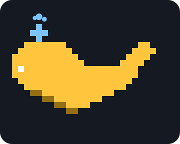
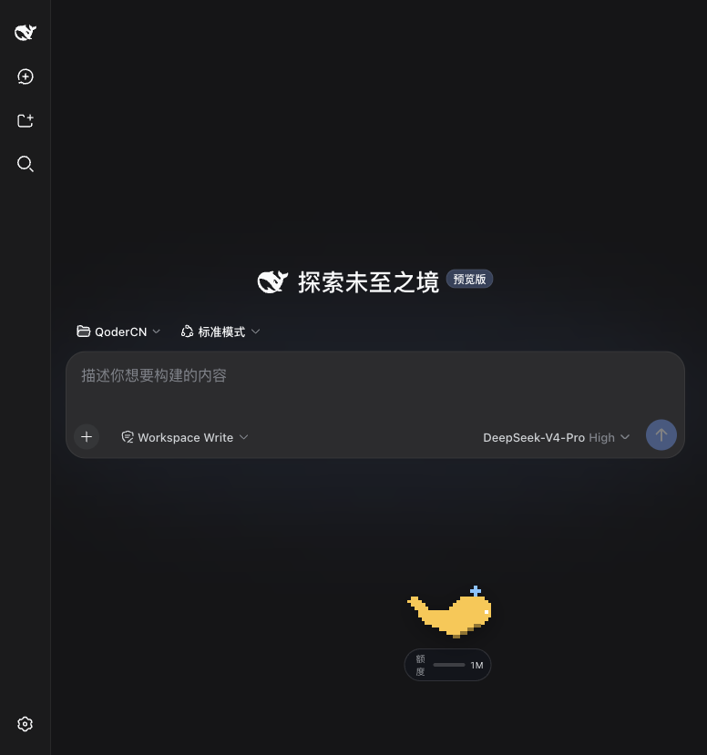
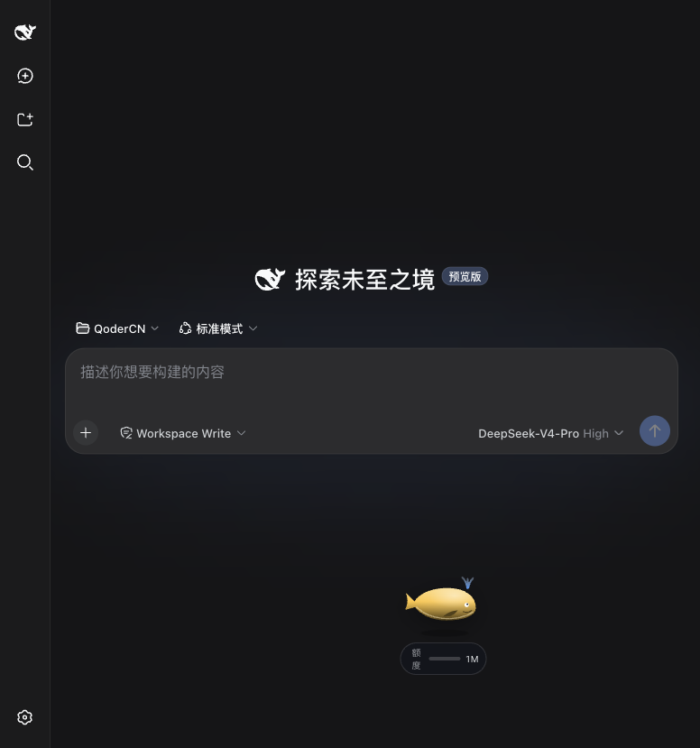
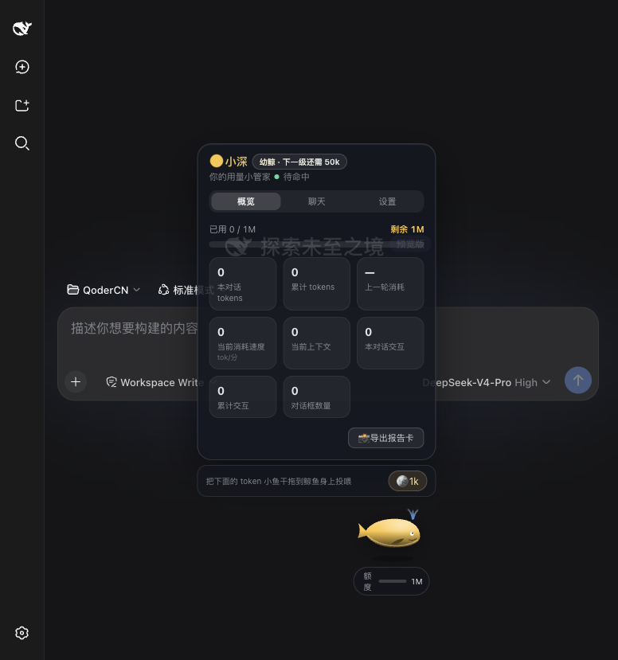
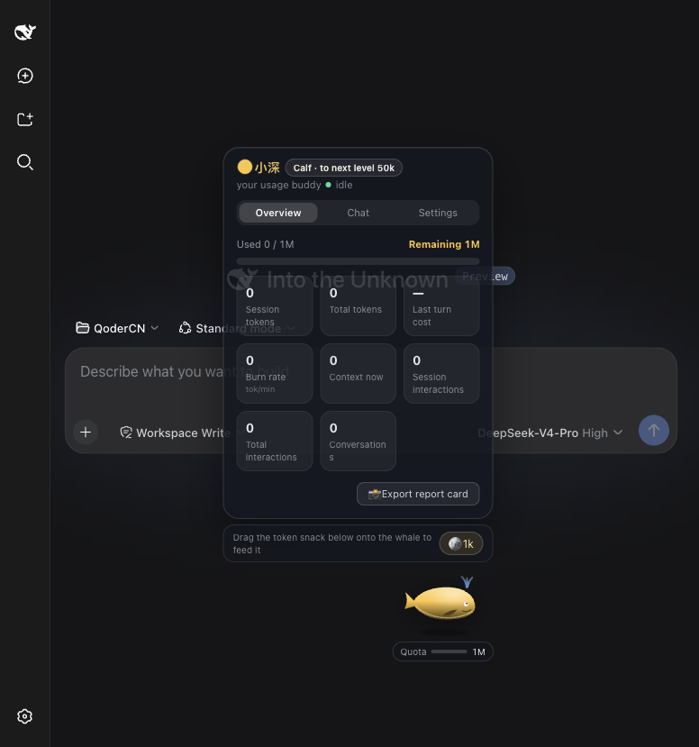
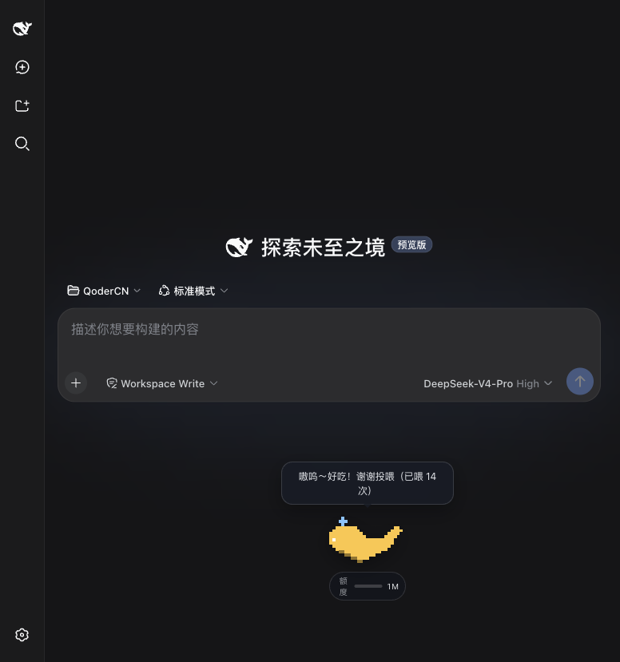

# dsh-cyber-pet 🐳

English | [中文](#中文说明)

A cyber whale pet for [DeepSeek Harness](https://github.com/deepseek-ai/deepseek-harness): a floating, feedable, color-customizable whale that lives inside the Web UI and reports your token usage, quota, context occupancy, interactions, and conversation counts — with three chat backends, growth levels, moods, milestone celebrations, and a one-click PNG report card.

## Gallery

**Two skins** — pixel-art and skeuomorphic (the animated tiles are live SVG recreations of the in-app skins; the photos are real screenshots):

| Pixel-art 像素风 | Skeuomorphic 拟物风 |
|:---:|:---:|
|  |  |
|  |  |

**The dashboard in both languages** (中文 / English):

| 中文面板 | English panel |
|:---:|:---:|
|  |  |

**It talks** — the whale reports every completed turn (cost + remaining quota) in a speech bubble:

<p align="center"></p>

> Want a screen recording instead? Drop an mp4 into `docs/` (e.g. `docs/demo.mp4`) and swap it in here — GitHub renders repo-committed videos natively.

## One-click install

Requirements: Node.js ≥ 22.19, pnpm (`corepack enable`), and a DeepSeek Harness checkout (tested with `0.1.0-rc.5`).

```sh
git clone https://github.com/deepseek-ai/deepseek-harness.git
git clone https://github.com/<you>/dsh-cyber-pet.git

cd dsh-cyber-pet
./install.sh ../deepseek-harness        # copies packages, wires 4 files, installs, builds

cd ../deepseek-harness
pnpm dsh web                            # open http://127.0.0.1:3080
```

That's it — the yellow whale appears in the bottom-right corner. The installer is idempotent and safe to re-run; options: `--force` (replace existing plugin files), `--skip-deps`, `--skip-build`.

Uninstall:

```sh
./uninstall.sh /path/to/deepseek-harness --purge
```

## What you get

- 🐋 **Two skins** — pixel-art and skeuomorphic; **seven preset colors + free picker** (default 小黄鲸)
- 🧭 **Behavior modes** — 活跃 / 静候 / 睡眠, via right-click quick menu or Settings
- 🏊 **Autonomous roaming** — swim speed follows the live token burn rate × your speed ratio, inside your chosen roam area
- 📊 **Glass dashboard** — 概览 / 聊天 / 设置 tabs; user-composed stat cards (visibility / size / order), quota bar, context occupancy, last-turn cost, burn rate
- 🎛️ **Under-whale badge** — click to cycle 额度 → 上下文 → 轮次
- 💬 **Chat with the whale** — 本地宝贝 (rule-based, zero requests), 在线宝贝 (any OpenAI-compatible endpoint you configure), 宿主宝贝 (host-side `petChat` Remote, credentials stay on the host — needs `DEEPSEEK_API_KEY`)
- 🌱 **Growth system** — 幼鲸 → 少年鲸 → 成年鲸 → 金冠鲸 (crown at max level)
- 😊 **Mood engine** — happy / focused / anxious (<10% quota) / sleepy
- 🎉 **Milestones & digest** — celebration every 10k tokens; "yesterday you burned X tokens" on first load
- 🍱 **Feeding** — drag the 🪙 snack onto the whale
- ⏸️ **Rest reminder** — naps for 3 minutes after N consecutive turns
- 📸 **Report card** — one-click PNG export with the whale and your numbers
- 🔊 **Soft sound effects** (toggleable), 🌍 中文 / English switch

All counters and preferences persist in browser `localStorage` (`dsh.cyber-pet.v3`).

## Repository layout

```
dsh-cyber-pet/
├── install.sh            # one-click installer
├── uninstall.sh          # one-click uninstaller
├── scripts/
│   └── patch-files.mjs   # idempotent registration engine (apply/revert)
├── docs/                 # gallery assets (screenshots + animated SVG demos)
├── ui-pet/               # → packages/client/ui-pet   (browser whale surface)
└── pet-chat/             # → packages/feedback/pet-chat (host chat Remote)
```

The installer copies `ui-pet/` and `pet-chat/` into the harness workspace and adds four registration lines (`tsconfig.host.json`, `tsconfig.client.json`, `packages/bundle/web-app/package.json`, `packages/bundle/web-app/cordis.patch.yml`). See [ui-pet/README.md](ui-pet/README.md) for the full manual procedure, usage guide, and troubleshooting.

## Notes

- DeepSeek Harness is in developer preview and breaks APIs between releases — pin the harness version this repo was tested against (`0.1.0-rc.5`).
- The 在线宝贝 backend keeps your API key in browser `localStorage`; prefer 宿主宝贝 when the host credentials are configured.

## Why this little whale exists

Amid great anticipation and excitement, DeepSeek Harness has finally been officially launched. Riding the surging wave of AI, each of us developers is a firsthand witness to this era. As backend engineers, our daily work involves either implementing requirements based on spec documents or refining business logic within the framework of various driving specifications and development standards; while the rapid iteration of AI tools boosts efficiency, it also subtly adds pressure to keep up — as if the slightest delay would leave us trailing behind the times.

Technology is constantly evolving, yet the passion for coding deep within my heart remains unchanged — a thought that is both poignant and wondrous. I usually handle business requirements on GitLab. Although I log into GitHub frequently, I rarely have the chance to let my guard down and play around there, tinkering with personal projects purely out of passion.

Early Saturday morning, I was casually browsing and came across a data structures practice assignment I'd uploaded years ago — which included a simple maze game implemented using a binary tree. Looking back with today's perspective, the code is a bit rough around the edges, but it's brimming with the pure joy of coding I felt back then. Inspired by the launch of DeepSeek Harness, an idea took root in my mind: I wanted to contribute my own small part to the Harness ecosystem.

As a pure backend developer with no prior experience in frontend technologies, I relied entirely on Qoder to complete the development of this little project. It's very small in scope, and the code is far from perfect — it might even hide some undiscovered bugs — so it's hardly a technically substantial project. Still, I hope this little thing can play its own small role within the Harness ecosystem and offer a bit of relaxation beyond technology to my peers who are constantly juggling business demands and standards.

In an era where everyone is being pushed to run faster and faster, regulations and pressure are ever-present. But I've always believed that amidst the grind of coding, we should carve out a few fragmented moments of leisure. May this little cyber pet add a moment of pure joy — free from KPIs and regulations — to your hectic development routine.

**Hello, friends.**

---

## 中文说明

给 [DeepSeek Harness](https://github.com/deepseek-ai/deepseek-harness) 的赛博鲸鱼宠物：一只悬浮在 Web 页面里、可以投喂、可以换色的鲸鱼，实时播报 token 用量、额度、上下文占用、交互次数与对话框数量——自带三种聊天后端、成长等级、情绪系统、里程碑庆祝与一键 PNG 报告卡。

### 界面预览

**两种造型** — 像素风与拟物风（动态图为应用内皮肤的 SVG 实时复刻，下方为真实截图）：

| 像素风 | 拟物风 |
|:---:|:---:|
|  |  |
|  |  |

**中英双语面板**：

| 中文面板 | English 面板 |
|:---:|:---:|
|  |  |

**它会说话** — 每轮对话结束，鲸鱼用气泡播报本轮消耗与剩余额度：

<p align="center"></p>

> 想换成录屏？把 mp4 放进 `docs/`（如 `docs/demo.mp4`）再替换这里的引用即可，GitHub 原生支持仓库内视频。

### 一键安装

前置条件：Node.js ≥ 22.19、pnpm（`corepack enable`）、一份 DeepSeek Harness 源码（已按 `0.1.0-rc.5` 验证）。

```sh
git clone https://github.com/deepseek-ai/deepseek-harness.git
git clone https://github.com/<you>/dsh-cyber-pet.git

cd dsh-cyber-pet
./install.sh ../deepseek-harness        # 拷贝两个包、注册 4 处配置、安装并构建

cd ../deepseek-harness
pnpm dsh web                            # 打开 http://127.0.0.1:3080
```

就这样——右下角会出现小黄鲸。安装脚本幂等、可重复执行；可选参数：`--force`（覆盖已有插件文件）、`--skip-deps`、`--skip-build`。

卸载：

```sh
./uninstall.sh /path/to/deepseek-harness --purge
```

功能与目录说明见上文英文部分，详细的手动安装步骤、使用指南与常见问题见 [ui-pet/README.zh.md](ui-pet/README.zh.md)。

### 写在最后

满心期待与欣喜中，DeepSeek Harness 终于正式面世。身处奔涌向前的 AI 浪潮里，我们每个开发者都是这个时代的亲历者。作为后端工程师，日常工作里我们或是循着 Spec 文档推进需求，或是在各类驱动规范与开发标准的框架中打磨业务逻辑；AI 工具的飞速迭代在提效的同时，也无形中增添了追赶的压力，仿佛脚步稍慢，就会落在时代身后。

技术更迭不休，但心底对代码的那份热忱始终未变，想来既感慨又奇妙。我平日多在 GitLab 处理业务需求，GitHub 虽常登录，却很少能卸下包袱在其中畅玩，折腾些纯粹出于热爱的个人项目。

周六清晨随手翻逛，翻到自己多年前上传的数据结构实践作业——其中还有用二叉树实现的迷宫小游戏。以今日眼光回看，写法稚嫩，却盛满了当年纯粹敲代码的快乐。借着 DeepSeek Harness 发布的契机，我萌生了一个念头：想为 Harness 生态贡献一份自己微薄的力量。

我本身是纯后端开发，从未接触过前端技术，便全程依托 Qoder 完成了这个小宠物的开发。它体量很小，代码也远称不上完美，或许还藏着未被发现的 bug，算不上什么有技术分量的产出。但我仍希望这个小东西，能在 Harness 生态里发挥一点属于它的作用，也能给奔波在业务与规范中的同行们，带去一点技术之外的松弛。

在所有人都被时代推着加速奔跑的当下，规范与压力常伴左右。但我始终觉得，埋头 coding 的间隙，也该留一点碎片化的休闲时刻。愿这个小小的赛博宠物，能给你紧绷的开发日常，添上片刻无关 KPI、无关规范的纯粹快乐。

**你好，朋友们。**

## License

MIT — same as DeepSeek Harness.
